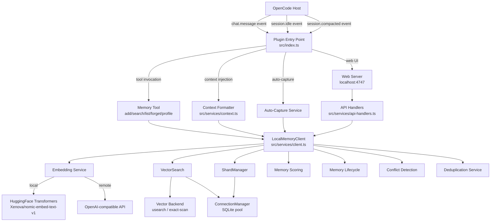

<!-- generated-by: gsd-doc-writer -->

# Architecture

opencode-mem0 is an [OpenCode plugin](https://github.com/nicepkg/opencode) that gives coding agents persistent memory through a local vector database built on SQLite and usearch. It intercepts chat messages and session events from the OpenCode host, stores technical knowledge as vector-embedded memories, and injects relevant context back into agent conversations — all running entirely on the local machine with no cloud dependencies.

## System Overview

The system is a **layered, event-driven plugin** that operates as a cognitive enhancement layer over the OpenCode agent framework. Its primary input is the stream of user–agent chat messages and session lifecycle events; its primary output is injected memory context (synthetic message parts) prepended to agent prompts. The architecture follows a service-oriented pattern where a thin plugin entry point delegates to specialized services for storage, scoring, retrieval, and lifecycle management. All data is persisted locally via sharded SQLite databases with pluggable vector search backends.



## Data Flow

### 1. Memory Injection (chat.message hook)

When a user sends a chat message, the `chat.message` hook fires:

1. **Filter** — Skip if system not configured, no text parts, or injection conditions not met (e.g., `injectOn: "first"` and non-first user message).
2. **Search** — Query `LocalMemoryClient.searchMemories()` with the user message text; uses vector similarity + FTS5 hybrid search with context boost and diversity filtering.
3. **Filter results** — Exclude current session memories (`excludeCurrentSession`), apply max-age filter (`maxAgeDays`), limit to `maxMemories` count.
4. **Format** — `formatContextForPrompt()` scores memories for query relevance, applies token budget (`injection.tokenBudget`), includes user profile context if `injectProfile` is enabled, and formats as plain/XML/YAML.
5. **Inject** — Prepend a synthetic `Part` to the output message parts, making memories appear as implicit context before the user's actual text.

### 2. Memory Storage (add/search tool calls or auto-capture)

When a memory is added:

1. **Embed** — `EmbeddingService.embed()` generates a vector from the content (local Xenova model or remote OpenAI-compatible API). Tags also get embedded separately.
2. **Deduplicate** — `DeduplicationService.checkDuplicateAtIngest()` compares against existing vectors; near-duplicates (>0.9 similarity) are silently merged.
3. **Score** — `calculateAllScores()` computes 7 factors: recency (Ebbinghaus half-life decay), frequency, importance (keyword + heuristic), utility, novelty (Jaccard similarity from existing), confidence, and interference penalty. Weighted sum produces a `strength` score.
4. **Classify** — `classifyMemory()` determines `storeType` (STM or LTM) based on memory type (e.g., `preference` → LTM, `episodic` → STM) and assigns a `decayRate`.
5. **Persist** — `VectorSearch.insertVector()` writes to the active shard database, including all scoring fields, metadata, and the raw vector blob.
6. **Conflict detect** — `detectConflicts()` runs asynchronously, comparing new content against existing memories via LLM or heuristic contradiction checks.

### 3. Session Idle → Auto-Capture

When a session goes idle:

1. **10-second debounce timer** fires after `session.idle` event.
2. **Transcript capture** — `performTranscriptCapture()` saves the raw session transcript to the FTS5-indexed transcript database. Runs independently of auto-capture, gated by `transcriptStorage.enabled`. Old transcripts are pruned by `cleanupOldTranscripts()` during the cleanup phase.
3. **Auto-capture** — `performAutoCapture()` retrieves recent messages, sends them to an LLM (via OpenCode's provider or a configured AI provider) with a system prompt that extracts technical knowledge, then stores the summary as a new memory.
4. **Profile learning** — `performUserProfileLearning()` analyzes unanalyzed user prompts to build/update the user profile (preferences, patterns, workflows).
5. **Cleanup** — Old transcripts pruned, SQLite WAL checkpointed.

### 4. Background Lifecycle Jobs

Two periodic jobs run continuously:

- **Scoring recalculation** (`startScoringRecalculation`) — Every 60 minutes (configurable), recomputes recency and utility scores for all memories based on elapsed time and access patterns.
- **Lifecycle maintenance** (`startLifecycleJob`) — Every 60 minutes, applies Ebbinghaus-inspired decay to memory `strength`, promotes high-strength STM memories to LTM, and archives memories below the `archiveThreshold`.

### 5. Compaction Recovery

When OpenCode compacts a session (summarizes old messages):

1. The `session.compacted` event fires.
2. `searchMemoriesBySessionID()` retrieves memories tagged with the compacted session.
3. A synthetic no-reply prompt is injected into the session with the restored memories, ensuring the agent doesn't lose context after compaction.

## Key Abstractions

| Abstraction                                                                        | File                                                | Description                                                                                                                                                                                                                      |
| ---------------------------------------------------------------------------------- | --------------------------------------------------- | -------------------------------------------------------------------------------------------------------------------------------------------------------------------------------------------------------------------------------- |
| `LocalMemoryClient`                                                                | `src/services/client.ts`                            | Central orchestrator for all memory operations (add, search, delete, list). Coordinates embedding, scoring, lifecycle, and storage.                                                                                              |
| `VectorSearch`                                                                     | `src/services/sqlite/vector-search.ts`              | Hybrid search engine: vector similarity via pluggable backend + FTS5 text search + multi-factor ranking with context boost and diversity filtering.                                                                              |
| `ShardManager`                                                                     | `src/services/sqlite/shard-manager.ts`              | Manages SQLite database shards per scope (user/project) and scope hash. Auto-creates new shards when `maxVectorsPerShard` is reached.                                                                                            |
| `ConnectionManager`                                                                | `src/services/sqlite/connection-manager.ts`         | LRU connection pool for SQLite databases (max 20 connections). Handles WAL mode, schema migrations, batch writes, and checkpointing.                                                                                             |
| `EmbeddingService`                                                                 | `src/services/embedding.ts`                         | Singleton that loads Xenova/transformers.js models locally or calls an OpenAI-compatible embedding API. Includes SHA-256-based LRU cache (100 entries).                                                                          |
| `calculateAllScores()` / `computeStrength()`                                       | `src/services/memory-scoring.ts`                    | 7-factor scoring functions: recency, frequency, importance, utility, novelty, confidence, interference. Configurable weights via `MemoryScoringWeights` interface; default strength = weighted sum.                              |
| `LifecycleManager`                                                                 | `src/services/memory-lifecycle.ts`                  | STM/LTM dual-store with Ebbinghaus decay curves. Promotes STM→LTM at `promotionThreshold` (0.7), archives below `archiveThreshold` (0.2).                                                                                        |
| `detectConflicts()` / `resolveConflict()`                                          | `src/services/memory-conflicts.ts`                  | LLM-backed contradiction detection between memories, with heuristic fallback. Stores conflicts in a dedicated table for resolution.                                                                                              |
| `DeduplicationService`                                                             | `src/services/deduplication-service.ts`             | Ingest-time near-duplicate detection (≥0.9 cosine similarity) and batch deduplication across shards.                                                                                                                             |
| `analyzeQueryIntent()` / `calculateContextBoost()` / `calculateDiversityPenalty()` | `src/services/retrieval-context.ts`                 | Query intent classification (troubleshooting/recall/exploration/implementation), context boost scoring, and diversity penalty for search result reranking. `RetrievalContext` interface defines the query analysis result shape. |
| `VectorBackend`                                                                    | `src/services/vector-backends/types.ts`             | Interface for pluggable vector index backends. Exported implementations: `USearchBackend`, `ExactScanBackend`. Internal `FallbackAwareBackend` (not exported) wraps primary + fallback via `createVectorBackend()`.              |
| `AIProviderFactory`                                                                | `src/services/ai/ai-provider-factory.ts`            | Factory for AI providers (openai-chat, openai-responses, anthropic, google-gemini) used by auto-capture and conflict detection.                                                                                                  |
| `TranscriptManager`                                                                | `src/services/sqlite/transcript-manager.ts`         | Stores raw session transcripts with FTS5 full-text search. Configurable retention via `transcriptStorage.maxAgeDays`.                                                                                                            |
| `UserProfileManager`                                                               | `src/services/user-profile/user-profile-manager.ts` | Manages user profiles with preferences, patterns, and workflows. Supports merge, versioning, and confidence decay.                                                                                                               |
| `WebServer`                                                                        | `src/services/web-server.ts`                        | HTTP server for the Memory Explorer web UI. Serves static SPA + REST API for CRUD, search, stats, conflicts, deduplication, and migration.                                                                                       |

## Directory Structure

```
src/
├── index.ts              # Plugin entry point: hooks, tool definition, event handlers
├── config.ts             # Configuration loading, validation (Zod), defaults, project/global merge
├── plugin.ts             # Plugin export shim
├── types/
│   └── index.ts          # Shared types: MemoryType, MemoryMetadata, AIProviderType
├── services/
│   ├── client.ts         # LocalMemoryClient — top-level memory operations
│   ├── embedding.ts      # EmbeddingService — local/remote embedding with LRU cache
│   ├── context.ts        # formatContextForPrompt — memory formatting for injection
│   ├── tags.ts           # Project/user tag generation from git config and directory
│   ├── auto-capture.ts   # Session idle → LLM-based technical knowledge extraction
│   ├── transcript-capture.ts  # Raw transcript storage and cleanup
│   ├── user-memory-learning.ts  # User profile learning from prompt analysis
│   ├── memory-scoring.ts       # 7-factor scoring algorithm
│   ├── memory-scoring-service.ts  # Periodic scoring recalculation job
│   ├── memory-lifecycle.ts     # STM/LTM decay, promotion, archival
│   ├── memory-conflicts.ts     # LLM + heuristic contradiction detection
│   ├── deduplication-service.ts  # Near-duplicate detection and removal
│   ├── retrieval-context.ts    # Query intent analysis and search reranking
│   ├── cleanup-service.ts      # Old memory and transcript cleanup
│   ├── migration-service.ts    # V1→V2 data migration
│   ├── web-server.ts           # HTTP server for web UI + REST API
│   ├── api-handlers.ts         # REST API endpoint handlers
│   ├── platform-server.ts      # Platform-agnostic HTTP server abstraction
│   ├── logger.ts               # Structured logging with level control
│   ├── privacy.ts              # Private content stripping (API keys, tokens)
│   ├── language-detector.ts    # Language detection via franc-min
│   ├── jsonc.ts                # JSONC (JSON with comments) parser
│   ├── secret-resolver.ts      # Secret resolution from env vars
│   ├── sqlite/
│   │   ├── sqlite-bootstrap.ts  # SQLite abstraction: Bun vs better-sqlite3 detection
│   │   ├── connection-manager.ts  # LRU connection pool with WAL, batching, migrations
│   │   ├── vector-search.ts     # Hybrid vector + FTS5 search with reranking
│   │   ├── shard-manager.ts     # Shard lifecycle: creation, rotation, counting
│   │   ├── transcript-manager.ts # FTS5 transcript storage and search
│   │   ├── schema.ts            # Schema version tracking and migrations
│   │   └── types.ts             # ShardInfo, MemoryRecord, SearchResult, MemoryConflict
│   ├── ai/
│   │   ├── ai-provider-factory.ts  # Provider factory (OpenAI, Anthropic, Gemini)
│   │   ├── opencode-provider.ts    # Bridge to OpenCode's connected AI providers
│   │   ├── provider-config.ts      # Provider configuration types
│   │   ├── providers/              # Provider implementations (openai-chat, openai-responses, anthropic, google-gemini)
│   │   ├── session/                # AI session management with expiration
│   │   ├── tools/                  # Structured output tool definitions
│   │   └── validators/            # Output validation schemas
│   ├── vector-backends/
│   │   ├── types.ts               # VectorBackend interface, VectorBackendFactoryOptions
│   │   ├── backend-factory.ts     # Creates backend with fallback chain (usearch→exact-scan)
│   │   ├── usearch-backend.ts     # USearch HNSW index implementation
│   │   └── exact-scan-backend.ts  # Brute-force cosine similarity fallback
│   ├── user-profile/
│   │   ├── types.ts               # UserProfile, UserProfileData types
│   │   ├── user-profile-manager.ts  # Profile CRUD, merge, confidence decay
│   │   ├── profile-context.ts     # Profile context extraction for injection
│   ├── user-prompt/
│   │   └── user-prompt-manager.ts  # User prompt storage and retrieval for learning
│   └── utils/
│       └── safe-transforms.ts     # Safe JSON parse, date conversion utilities
└── web/
    ├── index.html          # Single-page application shell
    ├── app.js              # SPA application logic
    ├── styles.css          # UI styles
    └── i18n.js             # Internationalization support
```

## Storage Architecture

Data is persisted in the directory configured by `storagePath` (default: `~/.opencode-mem0/data/`):

```
~/.opencode-mem0/data/
├── metadata.db              # Shard registry (scope, hash, path, vector count, active flag)
├── users/
│   └── user_<hash>_shard_0.db   # User-scoped memory shards
├── projects/
│   └── project_<hash>_shard_0.db # Project-scoped memory shards
├── transcripts.db           # FTS5-indexed session transcripts
└── .cache/                  # HuggingFace model cache (Xenova/nomic-embed-text-v1)
```

Each shard database contains a `memories` table with columns for content, vector blob, scoring fields (recency, frequency, importance, utility, novelty, confidence, interference, strength), lifecycle fields (store_type, decay_rate, is_deprecated, is_pinned), and metadata (tags, type, user info, project info). The `schema_version` table tracks applied migrations.

The `ConnectionManager` maintains up to 20 LRU-cached connections with WAL journaling, 64MB cache, and batch write support. When a shard exceeds `maxVectorsPerShard` (default: 50,000 vectors), the `ShardManager` rotates to a new shard file.

## Vector Search Pipeline

Search follows a multi-stage pipeline:

1. **Embed query** — Generate vector from query text (or fall back to text-only if embedding unavailable).
2. **Shard selection** — Resolve scope (project vs all-projects) and fetch matching shards.
3. **Per-shard search** — For each shard:
   - Vector backend returns top-K candidates by cosine similarity (over-fetch with 2× base multiplier, adaptive up to 8×).
   - FTS5 text search adds keyword-matching candidates.
   - Results are merged and deduplicated.
4. **Reranking** — Apply `RetrievalContext` scoring:
   - Context boost: memories matching project path, recent files, or query topics get up to 1.5× boost.
   - Diversity penalty: similar results are penalized to ensure topical variety.
   - Query-aware filtering: memories below `relevanceThreshold` (0.3) are dropped.
5. **Sort and return** — Scoring: `similarity = strength×0.4 + recencyScore×0.3 + vectorSimilarity×0.3`; `finalScore = similarity × contextBoost`; diversity penalty applied multiplicatively: `penalizedScore = finalScore × (1 − penalty)`.

The vector backend is selected via `vectorBackend` config:

- `usearch-first` (default) — Try USearch HNSW index; fall back to exact-scan on error.
- `usearch` — USearch only; error if unavailable.
- `exact-scan` — Brute-force cosine similarity (no index overhead).

## Configuration Layer

Configuration is loaded from two locations and deep-merged:

1. **Global**: `~/.config/opencode/opencode-mem0.jsonc` (or `.json`)
2. **Project**: `<project>/.opencode/opencode-mem0.jsonc` (or `.json`)

Project config overrides global. The `OpenCodeMemConfigSchema` (Zod) validates all fields. Secrets (API keys) are resolved via `resolveSecretValue()` which checks environment variables. See [CONFIGURATION.md](CONFIGURATION.md) for the full variable reference.
